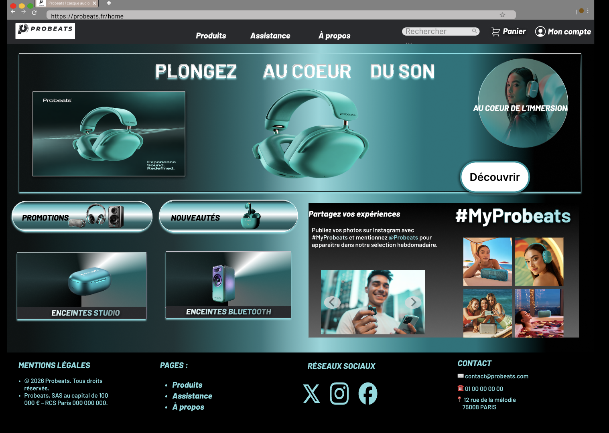
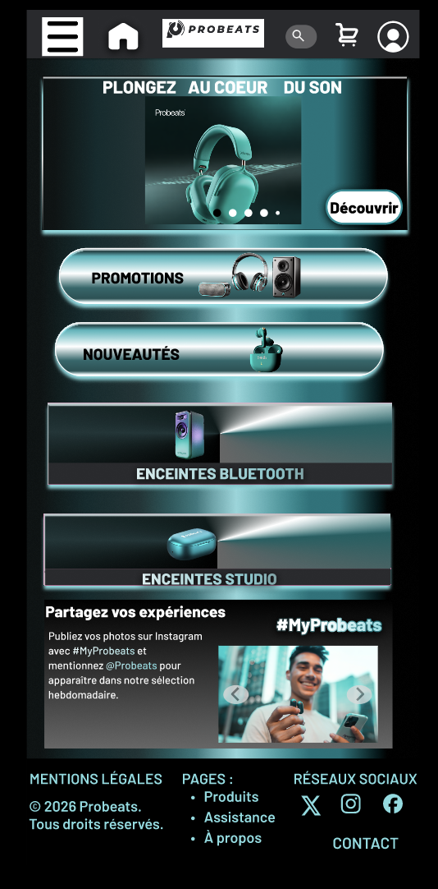

# DEVOIR-FIGMA-PROBEATS
Devoir qui aborde l'outil de maquettage Figma.

📱 Prototype interactif

👉 [Voir le prototype interactif](https://www.figma.com/design/slR9QgFk5eafmDEFNUAlj9/DEVOIR-FIGMA-PROBEATS?node-id=914-549&t=zu05vVFBZbvTwJDa-1)

✨ À découvrir

Amusez-vous à :

faire défiler les photos

cliquer sur les icônes interactives

explorer la navigation desktop et mobile

J’espère que ma vision de Probeats vous plaira 🎶

📋 Contenu du projet

Wireframes Desktop x5

Wireframes Mobile x5

Prototype Desktop (Accueil)

Prototype Mobile (Accueil)

Maquettes complètes (interactive)

Auto-layout

Grille 12 colonnes

## 💾 Fichier source (.fig)

Le fichier .fig dépasse la limite d’upload GitHub (25 Mo).  
Il est disponible via le lien GOOGLE DRIVE suivant :

[Télécharger le fichier en format .fig DEVOIR-FIGMA-PROBEATS.fig](https://drive.google.com/file/d/1zZDDPMSxdV8gXYf1GgmV-I4a9gt8tNbb/view?usp=drive_link)

## 🖼️ Aperçu

  

  

